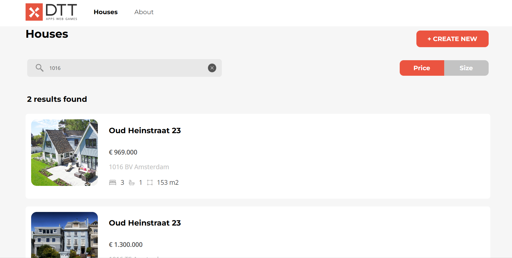

# House Listing



Quick guide what has been built:
- Implemented house search functionality by city, zip code, or street
- Developed sorting functionality by price and size
- Enabled users to create new house listings
- Implemented features for listing owners to edit or delete their listings

## Recommended IDE Setup

[VSCode](https://code.visualstudio.com/) + [Volar](https://marketplace.visualstudio.com/items?itemName=Vue.volar) (and disable Vetur).

## Customize configuration

See [Vite Configuration Reference](https://vitejs.dev/config/).

## Project Setup

```sh
npm install
```

### Compile and Hot-Reload for Development

```sh
npm run dev
```

### Compile and Minify for Production

```sh
npm run build
```
